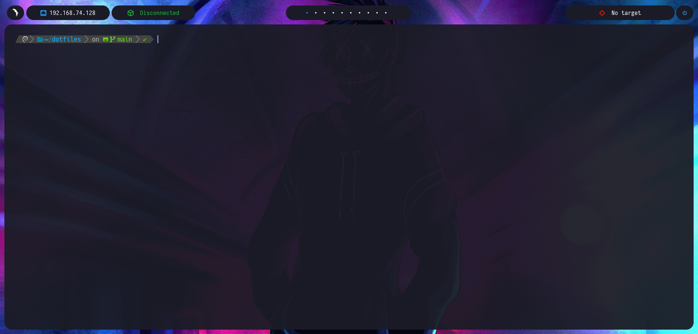

# 🦜 dotfiles

> Setup de **Parrot Security** con bspwm + polybar + kitty + zsh + Neovim.
> Pensado para pentesting (HTB / THM), rice limpio y productividad en VM.



[](LICENSE)


---

## ✨ Stack

| Componente | Para qué sirve |
|---|---|
| **bspwm** | Tiling window manager (binary space partitioning) |
| **sxhkd** | Daemon de atajos de teclado |
| **polybar** | Barra de estado modular (múltiples mini-barras flotantes) |
| **picom** | Compositor (sombras, transparencia, esquinas redondeadas) |
| **rofi** | Lanzador de aplicaciones y menús (powermenu, drun) |
| **kitty** | Emulador de terminal con soporte GPU |
| **zsh + Powerlevel10k** | Shell interactiva + prompt con info de git, VPN, etc. |
| **Neovim + NvChad** | Editor con LSP, autocompletado y formateadores |
| **feh** | Wallpaper |
| **dunst** | Notificaciones de escritorio |
| **keychain** | Reuso del ssh-agent entre sesiones |

---

## 📸 Demo

Lo que verás al iniciar sesión:

- Barras flotantes en lugar de una sola barra: workspaces (centro-arriba), VPN
  status (izquierda), Ethernet IP (izquierda), target de pentest (derecha) y
  botón de power-menu (esquina derecha).
- Esquinas redondeadas, transparencias y sombras a través de picom.
- Tema de polybar conmutable entre **dark** y **light**.
- Aliases para reemplazar `cat`/`ls` con `bat`/`lsd` (colores e iconos Nerd Font).
- Funciones `settarget` y `cleartarget` integradas con la barra: la IP/nombre
  del objetivo aparece en polybar mientras estás resolviendo una máquina.

---

## 📋 Pre-requisitos

### 1. Paquetes del sistema (apt)

```bash
sudo apt update && sudo apt install -y \
  bspwm sxhkd polybar picom rofi kitty zsh feh dunst \
  bat lsd tmux git stow keychain \
  zsh-autosuggestions zsh-syntax-highlighting \
  fzf
```

### 2. Neovim (binario oficial, **no** el de apt)

El de apt suele estar desactualizado. Quitamos el viejo e instalamos el oficial:

```bash
sudo apt purge -y neovim
curl -L -o /tmp/nvim-linux-x86_64.tar.gz \
  https://github.com/neovim/neovim/releases/latest/download/nvim-linux-x86_64.tar.gz
sudo tar -C /opt -xzf /tmp/nvim-linux-x86_64.tar.gz
sudo ln -sf /opt/nvim-linux-x86_64/bin/nvim /usr/local/bin/nvim
```

> El `.zshrc` añade `/opt/nvim-linux-x86_64/bin` al PATH automáticamente.

### 3. Powerlevel10k y fzf (clonar en `$HOME`)

```bash
# Tema zsh
git clone --depth=1 https://github.com/romkatv/powerlevel10k.git ~/powerlevel10k

# Fuzzy finder (Ctrl+R en historial)
git clone --depth 1 https://github.com/junegunn/fzf.git ~/.fzf
~/.fzf/install --all
```

> El `.zshrc` espera **exactamente** `~/powerlevel10k/`. Si lo mueves a otro
> sitio, ajusta la línea correspondiente.

### 4. Hack Nerd Font

```bash
wget -P /tmp \
  https://github.com/ryanoasis/nerd-fonts/releases/latest/download/Hack.zip
sudo unzip -o /tmp/Hack.zip -d /usr/local/share/fonts/
sudo fc-cache -fv
```

Las otras fuentes (Iosevka, Hurmit, Helvetica, Montserrat) usadas por polybar
ya están incluidas en `polybar/.config/polybar/fonts/`.

### 5. (Opcional) i3lock-fancy

Para el atajo Super+Shift+X (bloquear pantalla con blur):

```bash
sudo apt install -y i3lock-fancy
```

### 6. (Opcional) Llave SSH

El `.zshrc` incluye una línea que cachea tu llave SSH con `keychain`, para no
tener que escribir la passphrase cada vez que haces `git push` o te conectas
a un servidor remoto:

```bash
eval $(keychain --eval --quiet id_ed25519)
```

¿Para qué se usa la llave SSH?

- **GitHub / GitLab:** clonar repos privados con `git clone git@github.com:...`,
  hacer push sin pedir credenciales cada vez.
- **Servers remotos:** SSH a VPS, máquinas de laboratorio, etc.

Si **no tienes una llave todavía**, créala con:

```bash
ssh-keygen -t ed25519 -C "tu_email@example.com"
# Se guarda en ~/.ssh/id_ed25519 (privada) y ~/.ssh/id_ed25519.pub (pública).
# La pública es la que pegas en GitHub → Settings → SSH and GPG keys.
```

Si tu llave **se llama distinto** (`id_rsa` por ejemplo), edita la línea de
`keychain` en `zsh/.zshrc` con el nombre correcto. Si no usas SSH para nada,
puedes comentar esa línea entera.

---

## 🚀 Instalación

### Paso 1 — Clonar el repo

```bash
git clone https://github.com/M1gu3l4ngel/dotfiles-parrot.git ~/dotfiles
cd ~/dotfiles
```

### Paso 2 — Ejecutar el instalador

```bash
./install.sh
```

El script:

- Hace **backup automático** de tus configs actuales con sufijo `.pre-dotfiles.bak`.
- Crea symlinks desde `~/.config/` y `~/` hacia los archivos del repo.
- Enlaza el wallpaper por defecto del repo a `~/.config/wallpaper.jpg`
  **solo si no tienes ya uno** (no pisa wallpapers personales).
- Crea `~/.config/bin/target` vacío para que el módulo de target en polybar
  no falle la primera vez.
- Es **idempotente**: corre N veces sin romper nada.

### Paso 3 — Cambiar el shell a zsh

```bash
chsh -s $(which zsh)
```

Cierra sesión y vuelve a entrar para que el cambio tenga efecto.

La primera vez que abras zsh, Powerlevel10k te lanzará su asistente
(`p10k configure`). Si lo saltas o quieres rehacerlo: `p10k configure` desde
cualquier terminal.

### Paso 4 — Probar dentro de bspwm

Cierra sesión gráfica, elige **bspwm** en el login manager, y vuelve a entrar.
Atajos clave para empezar:

- **Super + Enter** → abrir kitty
- **Super + D** → lanzador de apps (rofi)
- **Super + Shift + R** → reiniciar bspwm
- **Super + Escape** → recargar sxhkd (después de editar atajos)

---

## ⌨️ Atajos esenciales

> Lista completa en [`sxhkd/.config/sxhkd/sxhkdrc`](sxhkd/.config/sxhkd/sxhkdrc).

### Apps y sistema

| Atajo | Acción |
|---|---|
| `Super + Enter` | Abrir terminal (kitty) |
| `Super + D` | Lanzador rofi |
| `Super + Shift + F` | Firefox |
| `Super + Shift + X` | Bloquear pantalla (i3lock-fancy) |
| `Super + Escape` | Recargar sxhkd |
| `Super + Shift + R` | Reiniciar bspwm |
| `Super + Shift + Q` | Salir de bspwm (cierra sesión) |

### Manejo de ventanas

| Atajo | Acción |
|---|---|
| `Super + Q` | Cerrar ventana (amable) |
| `Super + Shift + Q` | Matar ventana (forzado) |
| `Super + ←/↓/↑/→` | Mover foco |
| `Super + Shift + ←/↓/↑/→` | Mover ventana flotante |
| `Super + Alt + ←/↓/↑/→` | Redimensionar ventana |
| `Super + T` | Modo tiled |
| `Super + S` | Modo floating |
| `Super + F` | Fullscreen |
| `Super + M` | Alternar monocle / tiled |
| `Super + G` | Intercambiar con la ventana más grande |

### Workspaces

| Atajo | Acción |
|---|---|
| `Super + 1..9, 0` | Saltar al workspace N |
| `Super + Shift + 1..9, 0` | Enviar ventana al workspace N |
| `Super + [` / `Super + ]` | Workspace anterior / siguiente |
| `Super + Tab` | Último workspace visitado |

### Kitty (dentro del terminal)

| Atajo | Acción |
|---|---|
| `Ctrl + Shift + Enter` | Nueva ventana en el mismo directorio |
| `Ctrl + Shift + T` | Nueva pestaña en el mismo directorio |
| `Ctrl + Shift + Z` | Alternar layout (stack) |
| `Ctrl + Shift + F5` | Recargar config de kitty |

---

## 🎯 Workflow de pentesting

El setup tiene integración nativa para tracking del target activo (útil para
HTB/THM).

### `settarget` y `cleartarget`

```bash
# Establecer máquina como target activo:
settarget 10.10.11.42 Cerberus

# Limpiar el target:
cleartarget
```

`settarget` escribe la IP + nombre en `~/.config/bin/target`. El script
`victim_to_hack.sh` (corriendo cada 2s vía polybar) lee ese archivo y muestra
la info en la barra superior derecha:

```
🎯 10.10.11.42 - Cerberus
```

Si no hay target, muestra `🎯 No target`.

### VPN status (HTB / THM)

La barra izquierda muestra el estado de la VPN. Detecta automáticamente la
interfaz `tun0` (la que crea OpenVPN):

- **Conectada:** `📡 10.10.14.x`
- **Desconectada:** `📡 Disconnected`

Si tu VPN usa otra interfaz (WireGuard, varios túneles), ajusta el script
en `scripts/.config/scripts/vpn_status.sh`.

### Ethernet status

La otra mini-barra de la izquierda muestra la IP de la interfaz Ethernet
(por defecto `ens33`, típica en VMs). Para cambiarla, edita
`scripts/.config/scripts/ethernet_status.sh`.

---

## 🎨 Personalización rápida

### Cambiar wallpaper

```bash
cp /ruta/a/tu/wallpaper.jpg ~/.config/wallpaper.jpg
# Recargar bspwm:
bspc wm -r
```

`~/.config/wallpaper.jpg` por defecto es un symlink al wallpaper del repo
(`assets/wallpaper.jpg`). Sobrescribirlo con un archivo real lo desconecta
del repo; si quieres volver al default, borra el archivo y corre `install.sh`
de nuevo.

### Cambiar tema de polybar (dark ↔ light ↔ default)

```bash
# Cambiar a dark:
cp ~/dotfiles/polybar/.config/polybar/colors_dark.ini \
   ~/dotfiles/polybar/.config/polybar/colors.ini
~/.config/polybar/launch.sh

# Cambiar a light:
cp ~/dotfiles/polybar/.config/polybar/colors_light.ini \
   ~/dotfiles/polybar/.config/polybar/colors.ini
~/.config/polybar/launch.sh
```

### Cambiar tema de rofi

Hay 25+ temas en `rofi/.config/rofi/themes/`. Edita
`rofi/.config/rofi/config.rasi` y reemplaza el nombre tras `@theme`:

```rasi
@theme "themes/spotlight-dark"   // ejemplo
```

### Cambiar tema de Neovim

```vim
:Telescope themes
" o desde mappings: <leader>th
```

O permanentemente en `nvim/.config/nvim/lua/chadrc.lua`:

```lua
M.base46 = { theme = "monekai" }  -- cambia por: tokyonight, gruvbox, etc.
```

### Cambiar fuente del terminal

Edita `kitty/.config/kitty/kitty.conf`:

```conf
font_family    JetBrains Mono Nerd Font
font_size      14
```

### Añadir un keybind nuevo

Edita `sxhkd/.config/sxhkd/sxhkdrc` siguiendo el formato:

```
super + shift + n
	notify-send "hola"
```

Recarga con `Super + Escape`. No necesitas reiniciar la sesión.

---

## 📂 Estructura del repo

```
dotfiles/
├── bspwm/               → ~/.config/bspwm/  (bspwmrc + scripts/)
├── sxhkd/               → ~/.config/sxhkd/  (sxhkdrc)
├── polybar/             → ~/.config/polybar/
│   ├── current.ini      → bars activos (log, vpn, ethernet, target, primary)
│   ├── workspace.ini    → bar central de workspaces
│   ├── colors.ini       → paleta activa (sobrescribir con colors_dark/light)
│   ├── launch.sh        → mata y relanza todas las barras
│   ├── scripts/         → launcher, powermenu (no scripts pentest)
│   └── fonts/           → Iosevka, Hurmit, Helvetica, etc.
├── picom/               → ~/.config/picom/
├── rofi/                → ~/.config/rofi/  (config.rasi + themes/)
├── kitty/               → ~/.config/kitty/  (kitty.conf + color.ini)
├── nvim/                → ~/.config/nvim/  (NvChad como base)
├── scripts/             → ~/.config/scripts/
│   ├── ethernet_status.sh  → IP Ethernet (polybar)
│   ├── vpn_status.sh       → estado VPN (polybar)
│   └── victim_to_hack.sh   → lee target activo (polybar)
├── zsh/.zshrc           → ~/.zshrc
├── zsh/.p10k.zsh        → ~/.p10k.zsh
├── assets/              → preview.png + wallpaper.jpg default
├── install.sh           → instalador idempotente
├── CONTRIBUTING.md      → convenciones del proyecto (guía para PRs)
├── LICENSE              → MIT
└── README.md            → este archivo
```

---

## 🩺 Troubleshooting

### "El prompt zsh tarda mucho en aparecer"

Powerlevel10k usa un cache para el "instant prompt". Si lo desactivaste o lo
borraste:

```bash
p10k configure
```

### "polybar no muestra los workspaces"

Verifica que `bspwm` esté corriendo (`bspc query -W`) y reinicia polybar:

```bash
~/.config/polybar/launch.sh
```

### "El target no aparece en la barra"

Comprueba que el archivo existe y se está actualizando:

```bash
cat ~/.config/bin/target
settarget 10.10.10.1 TestMachine
cat ~/.config/bin/target   # debe mostrar "10.10.10.1 TestMachine"
```

Si el módulo sigue mostrando "No target", revisa que polybar tiene permisos
de lectura (no debería ser un problema en uso normal).

### "VPN status dice Disconnected aunque la VPN está activa"

El script asume que la interfaz se llama `tun0`. Verifica con `ip link`:

```bash
ip link | grep -i 'tun\|wg'
```

Si tu VPN usa otra interfaz (ej. `wg0`, `tun1`), edita
`~/.config/scripts/vpn_status.sh` y reemplaza `tun0`.

### "keychain me pide la passphrase en cada terminal"

Verifica que la llave existe:

```bash
ls ~/.ssh/id_ed25519
```

Si tienes otra llave (`id_rsa`, etc.), edita el `.zshrc`:

```bash
eval $(keychain --eval --quiet id_rsa)   # o el nombre de tu llave
```

### "El cursor de kitty es una barra, no un underline (o viceversa)"

`kitty.conf` lo establece a `beam` (barra), sobrescribiendo el `Underline`
que pone `color.ini`. Si quieres `Underline`, comenta la línea
`cursor_shape beam` en `kitty.conf`.

### "Super + Alt + Flechas no redimensiona"

Verifica que el script existe y tiene permisos de ejecución:

```bash
ls -la ~/.config/bspwm/scripts/bspwm_resize
```

Si no aparece, vuelve a correr `./install.sh` (es un symlink al repo).

### "Me equivoqué editando un archivo y no enciende bspwm"

Tu config previa está respaldada con sufijo `.pre-dotfiles.bak`:

```bash
ls -la ~/.config/bspwm/*.bak ~/.zshrc.pre-dotfiles.bak 2>/dev/null
```

Renombra el `.bak` al nombre original si quieres restaurar.

---

## 📐 Convenciones del proyecto

Si vas a contribuir, adaptar el repo o abrir un PR, las reglas de estilo,
formato de commits y archivos protegidos están documentadas en
[`CONTRIBUTING.md`](CONTRIBUTING.md). El `.editorconfig` de la raíz hace
además que tu editor respete la indentación correcta automáticamente.

---

## 🙏 Créditos

Setup originalmente basado en el curso de personalización de Linux de
**[S4vitar](https://github.com/s4vitar)**. Las configuraciones de **bspwm**,
**sxhkd**, **polybar** y **picom** parten de su estilo y enfoque pedagógico.

Adaptado y mantenido por **[M1gu3l4ng3l](https://github.com/M1gu3l4ngel)**
para flujo personal de pentesting.

---

## 📜 Licencia

[MIT](LICENSE) — usa, copia, modifica libremente. Si te resulta útil,
una ⭐ siempre se agradece.

---

Hecho con 🦜 por **[M1gu3l4ng3l](https://github.com/M1gu3l4ngel)**
