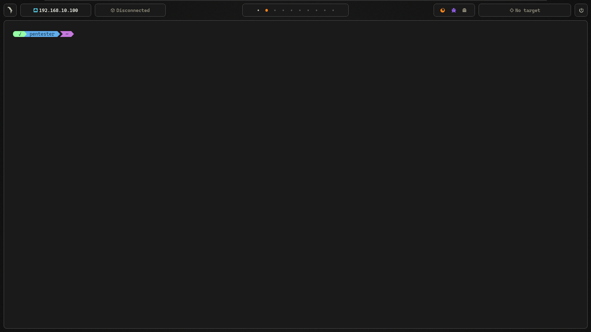

**English** | [Español](README.es.md)

# dotfiles-parrot

A pentesting workstation on Parrot OS: bspwm, polybar, kitty, zsh and Neovim,
with system hardening and a one-command install.



## One-command setup

Starting from scratch, with no VM yet? Follow
[docs/primeros-pasos.md](docs/primeros-pasos.md) (in Spanish): create the VM,
install Parrot, set up the environment, check it and take a snapshot.

On a fresh Parrot OS 7 install, as a regular user (it asks for the sudo
password once):

```bash
git clone https://github.com/M1gu3l4ngel/dotfiles-parrot.git ~/dotfiles
```

```bash
cd ~/dotfiles
```

```bash
./bootstrap.sh
```

Then reboot and pick the `bspwm` session on the login screen.

## Requirements

- Parrot OS 7 (based on Debian 13). `anonsurf` only exists on Parrot.
- A user with sudo rights and an internet connection.
- An X11 session: bspwm does not run on Wayland.
- On VMware: "Accelerate 3D graphics" enabled and 2 GB or more of graphics
  memory. See [docs/vmware.md](docs/vmware.md) (in Spanish).

## What bootstrap.sh does

Every step checks whether it is already done, so it can be run again safely
(for example, after a network failure).

| Step | What it installs or configures |
|---|---|
| 1 | apt packages: desktop, terminal tools, security, openvpn, VSCodium |
| 2 | Nerd Fonts (CaskaydiaCove and Hack) in `~/.local/share/fonts/` |
| 3 | Official Neovim in `/opt`, linked as `/usr/local/bin/nvim` |
| 4 | oh-my-posh (prompt) in `~/.local/bin/` |
| 5 | nvm, Node 24, pnpm and Claude Code |
| 6 | Config symlinks in `~/.config/` and `~/.claude/` (`install.sh`) |
| 7 | VSCodium extensions from Open VSX (`vscodium/extensions.txt`) |
| 8 | System hardening (`system/setup.sh`): firewall, sudoers, automatic patches, login screen |
| 9 | zsh as the default shell |
| 10 | Prints the remaining manual steps |

Everything that does not come from apt is downloaded at a pinned version and
verified against a SHA-256 hash before it is installed.

## Manual steps after installing

They involve secrets, so they are not automated (guides in Spanish):

1. SSH and GPG keys, commit signing and `pass`:
   [docs/claves-y-secretos.md](docs/claves-y-secretos.md).
2. Firefox profile for pentesting: [docs/firefox.md](docs/firefox.md).

## Install on top of an existing setup

If the environment is already installed and you only want these configs, from
`~/dotfiles`:

```bash
./install.sh
```

Before creating each link, `install.sh` renames whatever is at the target
(file, folder or your own symlink) with the `.pre-dotfiles.bak` suffix. To go
back, see [Uninstall](#uninstall).

## Uninstall

`uninstall.sh` reverts `install.sh`: it removes the links that point to this
repo and puts your original files back from their `.pre-dotfiles.bak` copies.
As a regular user, from `~/dotfiles`:

1. See what it would do, without changing anything:

    ```bash
    ./uninstall.sh --dry-run
    ```

2. Apply it:

    ```bash
    ./uninstall.sh
    ```

3. Log out and back in to use the original configuration.

It only removes links from this repo: if a target holds a file of yours, it
leaves it and warns. It does not uninstall packages or revert the
`system/setup.sh` hardening, nor the settings `install.sh` applies without
links (GTK4 dark mode, Nautilus as the folder handler, file indexer disabled).
Dated copies (`.pre-dotfiles.bak.<date>`), from reinstalls, are not restored:
the script lists them so you can choose by hand.

The list of links lives in `lib/links.sh` and both scripts share it: to add a
new config, add one line there.

## Repository layout

| Directory | Contents | Installed to |
|---|---|---|
| `bspwm/` | Window manager and resize script | `~/.config/bspwm/` |
| `sxhkd/` | Keyboard shortcuts | `~/.config/sxhkd/` |
| `polybar/` | Bars, color palette and launcher | `~/.config/polybar/` |
| `picom/` | Compositor (corners, transparency) | `~/.config/picom/` |
| `rofi/` | Application launcher and themes | `~/.config/rofi/` |
| `kitty/` | Terminal | `~/.config/kitty/` |
| `dunst/` | Notifications | `~/.config/dunst/` |
| `gtk/` | File manager colors and settings (GTK4) | `~/.config/gtk-4.0/` |
| `vscodium/` | VSCodium settings, shortcuts and extensions | `~/.config/Visual Studio Code/User/` |
| `xkb/` | Keyboard layout (us and latam) | `~/.config/xkb/` |
| `zsh/` | Shell | `~/.zshrc` |
| `nvim/` | Neovim (NvChad) | `~/.config/nvim/` |
| `gnupg/` | GPG agent configuration | `~/.gnupg/gpg-agent.conf` |
| `oh-my-posh/` | Prompt theme | Read from the repo |
| `claude/` | Global Claude Code layer ([claude/README.md](claude/README.md)) | `~/.claude/` (and `settings.json` from the template) |
| `scripts/` | polybar modules, target and anonymity | `~/.config/scripts/` |
| `system/` | Hardening, sudoers, Firefox, apt | `/etc`, `/usr/local/sbin` (copies) |
| `assets/` | Desktop screenshot and default wallpaper | `~/.config/wallpaper.jpg` (the wallpaper) |
| `docs/` | Detailed guides (in Spanish) | Not installed |
| `lib/` | Link list shared by `install.sh` and `uninstall.sh` | Not installed |
| `tools/` | Repo checks (`check.sh`) | Not installed |

## Shortcuts

### System and applications

| Shortcut | Action |
|---|---|
| `Super+Enter` | Terminal (kitty) |
| `Super+D` | Application launcher (rofi) |
| `Super+E` | File manager (Nautilus); also by clicking the Parrot logo |
| `Super+Shift+F` | Personal Firefox |
| `Super+Shift+P` | Pentest Firefox |
| `Super+A` | Toggle anonymity through Tor |
| `Super+Shift+X` | Lock the screen |
| `Super+Escape` | Reload shortcuts |
| `Super+Alt+R` | Reload bspwm (and polybar) |
| `Super+Alt+Q` | Log out |
| Power button (polybar, right corner) | Menu: clean shutdown, reboot or log out |
| `Alt+Shift` | Switch keyboard layout (us / latam) |

### Windows

| Shortcut | Action |
|---|---|
| `Super+Q` | Close the window |
| `Super+Shift+Q` | Force-close the window |
| `Super+Arrows` | Move focus |
| `Super+Shift+Arrows` | Swap with the neighboring window |
| `Super+Alt+Arrows` | Resize |
| `Super+Ctrl+Arrows` | Move a floating window |
| `Super+T` / `Super+S` / `Super+F` | Tiled / floating / fullscreen |
| `Super+M` | Toggle between tiled and a single window |
| `Super+G` | Swap with the largest window |

### Desktops

| Shortcut | Action |
|---|---|
| `Super+1` ... `Super+0` | Go to desktop 1 to 10 |
| `Super+Shift+1` ... `Super+Shift+0` | Send the window to that desktop |
| `Super+[` / `Super+]` | Previous / next desktop |
| `Super+Tab` | Last visited desktop |

### Terminal (kitty and zsh)

| Shortcut | Action |
|---|---|
| `Ctrl+Shift+Enter` | New kitty window in the same directory |
| `Ctrl+Shift+T` | New tab in the same directory |
| `Ctrl+Tab` | Switch tab |
| `Ctrl+Arrows` | Move focus between kitty windows |
| `Ctrl+Shift+V` | Paste |
| `Shift+Arrows` / `Ctrl+Shift+Arrows` | Select text by character / by word |
| `Ctrl+U` | Clear the line |
| `Ctrl+R` / `Ctrl+T` | Search history / search files (fzf) |
| `Esc` `Esc` | Add or remove `sudo` on the command |

For the pentesting workflow (VPN, target, which IP to use) see
[docs/pentesting.md](docs/pentesting.md) (in Spanish).

## Troubleshooting

| Symptom | Cause | Fix |
|---|---|---|
| Black screen or bspwm does not start on login | Wayland session | Pick the `bspwm` session at login |
| The desktop is slow when switching workspaces | VM without 3D acceleration | Enable it in VMware ([docs/vmware.md](docs/vmware.md)) |
| `glxinfo` says `Accelerated: no` | False positive from the VMware driver | Check the renderer: `SVGA3D` is correct |
| Icons show as squares | Nerd Fonts missing | Run `./bootstrap.sh` again |
| A `.zshrc` change does not apply | Each terminal keeps what it loaded at startup | `exec zsh` in that terminal |
| keychain asks for the passphrase in every terminal | The SSH key is not named `id_ed25519` | Change the name in the keychain line of `zsh/.zshrc` |
| Anonymity fails with "Tor no arrancó" | The sudoers rule is missing | `sudo ./system/setup.sh` from `~/dotfiles` |
| Notifications appear at the top and in blue | dunst started before its config existed | `dunstctl reload` |
| polybar uses a lot of CPU | A module with `interval = 0` | Use an interval greater than 0 |

To restore the configuration you had before these dotfiles, see
[Uninstall](#uninstall).

## Documentation

Detailed guides in [docs/](docs/README.md) (in Spanish): pentesting,
anonymity, Firefox, keys and secrets, VMware and customization.

To contribute or change the repo: [CONTRIBUTING.md](CONTRIBUTING.md).

## Credits and license

The prompt and the color palette are shared with
[dotfiles-windows](https://github.com/M1gu3l4ngel/dotfiles-windows).

[MIT](LICENSE) license.
