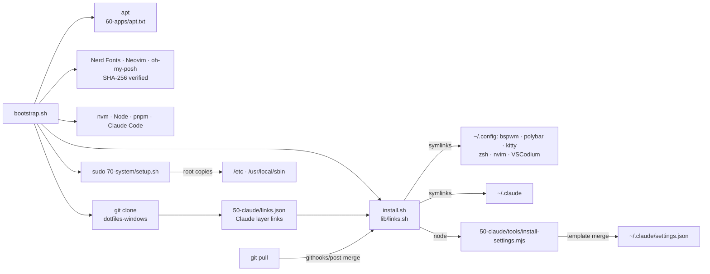

**English** | [Español](README.es.md)

<p align="center">
  <picture>
    <source media="(prefers-color-scheme: dark)" srcset="assets/dotfiles-parrot-lockup-white.svg">
    
  </picture>
</p>

<p align="center">
  A pentesting workstation on Parrot OS in one command.<br>
  bspwm, polybar, kitty, zsh with oh-my-posh and Neovim, with system hardening, a global Claude
  Code layer and verified downloads.
</p>

<p align="center">
  <a href="#structure">Structure</a> ·
  <a href="#how-it-works">How it works</a> ·
  <a href="#getting-started">Getting started</a> ·
  <a href="#usage">Usage</a> ·
  <a href="#documentation">Documentation</a> ·
  <a href="#contributing">Contributing</a> ·
  <a href="#security">Security</a> ·
  <a href="#license">License</a>
</p>

<p align="center">
  <a href="https://github.com/M1gu3l4ngel/dotfiles-parrot/actions/workflows/ci.yml"></a>
  
  
  
  <a href="LICENSE"></a>
</p>

---


## Structure

Each numbered folder is one layer of the environment, in the same order as
[dotfiles-windows](https://github.com/M1gu3l4ngel/dotfiles-windows), with its own README: what
each file is, where it is linked, how to reload it and what not to touch.

| Folder | Contents |
|---|---|
| `10-shell/` | zsh and the oh-my-posh prompt, shared with Windows ([10-shell/README.md](10-shell/README.md)) |
| `15-git/` | git identity, commit signing and the GPG agent ([15-git/README.md](15-git/README.md)) |
| `20-terminal/` | kitty ([20-terminal/README.md](20-terminal/README.md)) |
| `25-desktop/` | bspwm, sxhkd, polybar, picom, rofi, dunst, GTK4, keymap and the polybar scripts ([25-desktop/README.md](25-desktop/README.md)) |
| `30-editor/` | Neovim with NvChad and VSCodium ([30-editor/README.md](30-editor/README.md)) |
| `40-format/` | Global Prettier and EditorConfig style for projects without their own ([40-format/README.md](40-format/README.md)) |
| `60-apps/` | The apt package list that `bootstrap.sh` installs ([60-apps/README.md](60-apps/README.md)) |
| `70-system/` | Hardening as root copies: firewall, sudoers, Firefox, apt, login screen ([70-system/README.md](70-system/README.md)) |

And around them:

| Path | Contents |
|---|---|
| `bootstrap.sh` | One-command install |
| `install.sh` | Config links (`--check` to see their state, `--dry-run` to simulate) |
| `uninstall.sh` | Removes the links and restores the backups (`--dry-run` to simulate) |
| `lib/` | The link list shared by `install.sh` and `uninstall.sh` |
| `githooks/` | `post-merge`: runs `install.sh` after each `git pull` with changes |
| `tools/` | Checks (`check.sh`, the same as CI) and the install tests |
| `assets/` | Logos, desktop screenshot and default wallpaper |
| `docs/` | Guides ([docs/README.md](docs/README.md)) |
| `.claude/rules/` | Project conventions (loaded by Claude Code) |

## How it works

`bootstrap.sh` installs the tools; `install.sh` links each configuration file from the repo to
where its program reads it. Since they are links, editing the repo is editing the live
configuration, and a `git pull` on another PC applies it there.


```mermaid
flowchart LR
    B["bootstrap.sh"] --> A["apt<br/>60-apps/apt.txt"]
    B --> F["Nerd Fonts · Neovim · oh-my-posh<br/>SHA-256 verified"]
    B --> N["nvm · Node · pnpm · Claude Code"]
    B --> C["git clone<br/>dotfiles-windows"]
    B --> I["install.sh<br/>lib/links.sh"]
    B --> S["sudo 70-system/setup.sh"]
    I -- "symlinks" --> H["~/.config: bspwm · polybar · kitty<br/>zsh · nvim · VSCodium"]
    C --> L["50-claude/links.json<br/>Claude layer links"]
    L --> I
    I -- "symlinks" --> K["~/.claude"]
    I -- "node" --> M["50-claude/tools/install-settings.mjs"]
    M -- "template merge" --> J["~/.claude/settings.json"]
    S -- "root copies" --> E["/etc · /usr/local/sbin"]
    G["git pull"] -- "githooks/post-merge" --> I
```

## Getting started

Starting from scratch, with no VM yet? Follow
[docs/getting-started.md](docs/getting-started.md): create the VM, install
Parrot, set up the environment, check it and take a snapshot. The short
version follows.

### Prerequisites

- Parrot OS 7 (based on Debian 13). `anonsurf` only exists on Parrot.
- An x86_64 (amd64) machine: Neovim and oh-my-posh are pinned to their x86_64
  builds, and `bootstrap.sh` stops on any other architecture before changing
  anything.
- A user with sudo rights and an internet connection.
- An X11 session: bspwm does not run on Wayland.
- On VMware: "Accelerate 3D graphics" enabled and 2 GB or more of graphics
  memory. See [docs/vmware.md](docs/vmware.md).

### Install in one command

On a fresh Parrot OS 7 install, as a regular user (it asks for the sudo
password once):

```bash
git clone https://github.com/M1gu3l4ngel/dotfiles-parrot.git ~/dotfiles
```

```bash
cd ~/dotfiles
```

```bash
./bootstrap.sh
```

Then reboot and pick the `bspwm` session on the login screen.

### What bootstrap.sh does

Every step checks whether it is already done, so it can be run again safely
(for example, after a network failure). `./bootstrap.sh --dry-run` shows what
each step would do, without sudo, downloads or changes.

| Step | What it installs or configures |
|---|---|
| 1 | apt packages from `60-apps/apt.txt`: desktop, terminal tools, security, openvpn, VSCodium |
| 2 | Nerd Fonts (CaskaydiaCove and Hack) in `~/.local/share/fonts/` |
| 3 | Official Neovim in `/opt`, linked as `/usr/local/bin/nvim` |
| 4 | oh-my-posh (prompt) in `~/.local/bin/` |
| 5 | nvm, Node 24, pnpm and Claude Code |
| 6 | Clones [dotfiles-windows](https://github.com/M1gu3l4ngel/dotfiles-windows) in `~/dotfiles-windows`, the source of the Claude Code layer |
| 7 | Config symlinks in `~/.config/` and `~/.claude/` and the merge of `~/.claude/settings.json` (`install.sh`) |
| 8 | VSCodium extensions from Open VSX (`30-editor/vscodium/extensions.txt`) |
| 9 | System hardening (`70-system/setup.sh`): firewall, sudoers, automatic patches, login screen |
| 10 | zsh as the default shell |
| 11 | Prints the remaining manual steps |

Everything that does not come from apt is downloaded at a pinned version and
verified against a SHA-256 hash before it is installed.

### Install only the configurations

If the environment is already installed and you only want these configs, from
`~/dotfiles`:

```bash
./install.sh
```

To see first what it would link, back up or set, without changing anything:

```bash
./install.sh --dry-run
```

To see the state of every link (`ok`, `MISSING`, `STALE` for an old repo path,
`FOREIGN` for a file not from the repo), of the `post-merge` hook and of
`~/.claude/settings.json`. It exits with 1 if something is not right:

```bash
./install.sh --check
```

`install.sh` also turns on the `githooks/post-merge` hook (`core.hooksPath`):
after each `git pull` that brings changes, it runs `install.sh` again, so a
new or moved config is linked without running it by hand.

Before creating each link, `install.sh` renames whatever is at the target
(file, folder or your own symlink) with the `.pre-dotfiles.bak` suffix; if the
link then fails, the original goes back. A link to an old path inside the repo
(a moved folder) is replaced without a backup. To go back, see
[Uninstall](#uninstall).

### Manual steps (involve secrets, not automated)

1. SSH and GPG keys, commit signing and `pass`:
   [docs/keys-and-secrets.md](docs/keys-and-secrets.md).
2. Firefox profile for pentesting: [docs/firefox.md](docs/firefox.md).

## Usage

### Keeping another PC up to date

Once a PC is set up, bringing it a change made on another one is a `git pull`.
On the PC where you made the change, commit and push. On the other one, as a
regular user:

```bash
cd ~/dotfiles
```

```bash
git pull
```

The configs are links into the repo, so what you pull is live as soon as each
program reloads it ([Reload a change](#reload-a-change)). After each pull git
also runs `install.sh` on its own (`githooks/post-merge`), and that covers the
rest:

- New or moved configs (`lib/links.sh`) are linked.
- New Claude Code hooks are merged into `~/.claude/settings.json`, with a
  backup first and without touching anything else in the file.
- If the pull changed `bootstrap.sh` or `60-apps/apt.txt`, run `./bootstrap.sh`
  yourself; if it changed `70-system/`, run `sudo ./70-system/setup.sh`.
  Installing programs and touching `/etc` are never automatic.

What is not versioned does not travel: the keys, `~/.gitconfig.local` and
`~/.claude/entorno.md`.

### Reload a change

Each program reads its configuration again with its own reload. Never with `kill`, `killall` or
`pkill`: these reloads close each program cleanly when it has to restart (polybar closes over IPC
and removes its socket).

| Component | Reload |
|---|---|
| bspwm (and polybar) | `Super+Alt+R` |
| sxhkd | `Super+Escape` |
| polybar | `~/.config/polybar/launch.sh` |
| picom | On saving `picom.conf` |
| dunst | `dunstctl reload` |
| kitty | `Ctrl+Shift+F5` |
| zsh | `exec zsh` (in each open terminal) |
| Neovim | Reopen it, or `:source %` |
| GPG agent | `gpg-connect-agent reloadagent /bye` |

### Shortcuts

#### System and applications

| Shortcut | Action |
|---|---|
| `Super+Enter` | Terminal (kitty) |
| `Super+D` | Application launcher (rofi) |
| `Super+E` | File manager (Nautilus); also by clicking the Parrot logo |
| `Super+Shift+F` | Personal Firefox |
| `Super+Shift+P` | Pentest Firefox |
| `Super+A` | Toggle anonymity through Tor |
| `Super+Shift+X` | Lock the screen |
| `Super+Escape` | Reload shortcuts |
| `Super+Alt+R` | Reload bspwm (and polybar) |
| `Super+Alt+Q` | Log out |
| Power button (polybar, right corner) | Menu: clean shutdown, reboot or log out |
| `Alt+Shift` | Switch keyboard layout (us / latam) |

#### Windows

| Shortcut | Action |
|---|---|
| `Super+Q` | Close the window |
| `Super+Shift+Q` | Force-close the window |
| `Super+Arrows` | Move focus |
| `Super+Shift+Arrows` | Swap with the neighboring window |
| `Super+Alt+Arrows` | Resize |
| `Super+Ctrl+Arrows` | Move a floating window |
| `Super+T` / `Super+S` / `Super+F` | Tiled / floating / fullscreen |
| `Super+M` | Toggle between tiled and a single window |
| `Super+G` | Swap with the largest window |

#### Desktops

| Shortcut | Action |
|---|---|
| `Super+1` ... `Super+0` | Go to desktop 1 to 10 |
| `Super+Shift+1` ... `Super+Shift+0` | Send the window to that desktop |
| `Super+[` / `Super+]` | Previous / next desktop |
| `Super+Tab` | Last visited desktop |

#### Terminal (kitty and zsh)

| Shortcut | Action |
|---|---|
| `Ctrl+Shift+Enter` | New kitty window in the same directory |
| `Ctrl+Shift+T` | New tab in the same directory |
| `Ctrl+Tab` | Switch tab |
| `Ctrl+Arrows` | Move focus between kitty windows |
| `Ctrl+Shift+V` | Paste |
| `Shift+Arrows` / `Ctrl+Shift+Arrows` | Select text by character / by word |
| `Ctrl+U` | Clear the line |
| `Ctrl+R` / `Ctrl+T` | Search history / search files (fzf) |
| `Esc` `Esc` | Add or remove `sudo` on the command |

For the pentesting workflow (VPN, target, which IP to use) see
[docs/pentesting.md](docs/pentesting.md).

### Uninstall

`uninstall.sh` reverts `install.sh`: it removes the links that point to this
repo and puts your original files back from their `.pre-dotfiles.bak` copies.
As a regular user, from `~/dotfiles`:

1. See what it would do, without changing anything:

    ```bash
    ./uninstall.sh --dry-run
    ```

2. Apply it:

    ```bash
    ./uninstall.sh
    ```

3. Log out and back in to use the original configuration.

It only removes links from this repo: if a target holds a file of yours, it
leaves it and warns. It does not uninstall packages or revert the
`70-system/setup.sh` hardening, nor the settings `install.sh` applies without
links (GTK4 dark mode, Nautilus as the folder handler, file indexer disabled).
Dated copies (`.pre-dotfiles.bak.<date>`), from reinstalls, are not restored:
the script lists them so you can choose by hand.

The list of links lives in `lib/links.sh` and both scripts share it: to add a
new config, add one line there. The Claude Code links are not listed there:
they come from `50-claude/links.json` of the
[dotfiles-windows](https://github.com/M1gu3l4ngel/dotfiles-windows) clone in
`~/dotfiles-windows`.

## Troubleshooting

| Symptom | Cause | Fix |
|---|---|---|
| Black screen or bspwm does not start on login | Wayland session | Pick the `bspwm` session at login |
| The desktop is slow when switching workspaces | VM without 3D acceleration | Enable it in VMware ([docs/vmware.md](docs/vmware.md)) |
| `glxinfo` says `Accelerated: no` | False positive from the VMware driver | Check the renderer: `SVGA3D` is correct |
| Icons show as squares | Nerd Fonts missing | Run `./bootstrap.sh` again |
| A `.zshrc` change does not apply | Each terminal keeps what it loaded at startup | `exec zsh` in that terminal |
| keychain asks for the passphrase in every terminal | The SSH key is not named `id_ed25519` | Change the name in the keychain line of `10-shell/zsh/.zshrc` |
| Anonymity fails with "AnonSurf no arrancó" | The sudoers rule is missing | `sudo ./70-system/setup.sh` from `~/dotfiles` |
| Notifications appear at the top and in blue | dunst started before its config existed | `dunstctl reload` |
| polybar uses a lot of CPU | A module with `interval = 0` | Use an interval greater than 0 |

To restore the configuration you had before these dotfiles, see
[Uninstall](#uninstall).

## Documentation

Guides in [docs/](docs/README.md), starting with the new PC one:
[docs/getting-started.md](docs/getting-started.md). Pentesting, anonymity, Firefox, keys and
secrets, VMware and customization have their own. Conventions in `.claude/rules/`.

## Contributing

Changes are welcome: the flow, the checks and the commit format are in
[CONTRIBUTING.md](CONTRIBUTING.md), and everyone who takes part follows the
[code of conduct](CODE_OF_CONDUCT.md).

## Security

A vulnerability is reported privately, never in a public issue:
[SECURITY.md](SECURITY.md).

## License

[MIT](LICENSE). The oh-my-posh prompt and the color palette are shared with
[dotfiles-windows](https://github.com/M1gu3l4ngel/dotfiles-windows).
